  

I'm Fan — a developer who turns repeated work into agents. My repos are where those agents live: skills other people's AI can run, MCP tooling, and automation that ships while I sleep.

### Now shipping

- **`[mcp]`** Content pipeline on Airtable + MCP — agents read, write and move lifecycle states straight from chat
- **`[ai-art]`** High Prompt Lab — a prompt-to-pixel system that turns briefs into production-grade graphics
- **`[video]`** HyperRemoEdit — automatic video editing built on Remotion + HyperFrames
- **`[knowledge]`** WIKID-LLM — a schema'd second brain an LLM can actually navigate

### Free agent skills

Plug these into Claude, Codex, Cursor or any MCP-capable agent:

- **[fix-it-skill](https://github.com/fancyism/fix-it-skill)** — relentless bug-hunting discipline: root cause or it didn't happen
- **[delegate-wave](https://github.com/fancyism/delegate-wave-skill)** — orchestrate parallel AI agents: decompose → dispatch → review → integrate
- **[gridgeist](https://github.com/fancyism/gridgeist)** — turns intent into a rigorous visual system, no generic-SaaS aftertaste

Copy them freely. If one saves your day, a star pays the rent.

  <code>21 public repos · 38 private builds · shipping since Dec 2023 · Bangkok UTC+7</code>

  <picture>
    <source media="(prefers-color-scheme: dark)" srcset="https://raw.githubusercontent.com/fancyism/fancyism/output/snake-dark.svg" />
    <source media="(prefers-color-scheme: light)" srcset="https://raw.githubusercontent.com/fancyism/fancyism/output/snake.svg" />
    
  </picture>

  the agent eats the backlog — regenerated daily

---

  I push new work almost every day.
  <strong><a href="https://github.com/fancyism?tab=follow">Follow @fancyism</a></strong> to catch it first.

  <i>Most of this code was written at 2am — if you spot a bug, that's my signature.</i> 🌙

