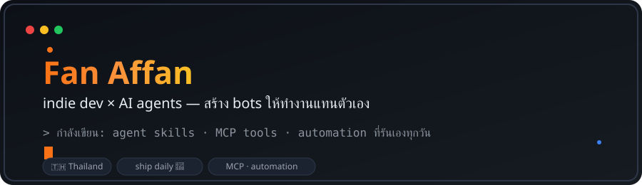

  

  

---

## 🤖 ผมเชื่อว่า "dev คนเดียว + AI agents = ทีมได้"

ผมคือ **Fan** — indie dev ที่ไม่ชอบทำงานซ้ำ ๆ วิธีแก้ของผมคือสร้าง **AI agents เป็นของตัวเอง** มาทำงานแทน: เขียนโค้ด รีวิว วิจัย รัน automation ตอนผมนอน 😴

> งานที่คนอื่นก๊อปมาทำทุกวัน — ผมเขียน agent ให้มันทำ แล้วไปปั่นของใหม่ต่อ 🌙

### 🔥 ตอนนี้กำลังปั่นอะไร

| โปรเจกต์ | คืออะไร |
|---|---|
| 🧵 **Content pipeline on Airtable + MCP** | ระบบจัดการคอนเทนต์ทั้งเส้น ต่อผ่าน MCP — agent อ่าน/เขียน/เปลี่ยนสถานะได้จากในแชท |
| 🎨 **High Prompt Lab** | ระบบ prompt-to-pixel — เปลี่ยนโจทย์ออกแบบให้เป็นภาพ production-grade ด้วย AI |
| 📺 **HyperRemoEdit** | ตัดต่อวิดีโออัตโนมัติด้วย Remotion + HyperFrames |
| 🧠 **WIKID-LLM** | second brain แบบมี schema — ให้ LLM เข้าใจคลังความรู้ส่วนตัวได้ |

---

## 🎁 ของฟรี — ติดตั้งให้ agent ของคุณได้เลย

| Skill | ทำอะไรให้ agent ของคุณ |
|---|---|
| 🔧 [**fix-it-skill**](https://github.com/fancyism/fix-it-skill) | วินัยแก้บั๊กจริงจัง — หา root cause ไม่ใช่แปะยาแก้อาการ (ใช้ได้กับ Claude, Codex, Cursor, Gemini...) |
| 🌊 [**delegate-wave**](https://github.com/fancyism/delegate-wave-skill) | กระจายงานให้ AI agents หลายตัวพร้อมกัน — decompose → dispatch → review → integrate |
| 🎨 [**gridgeist**](https://github.com/fancyism/gridgeist) | เปลี่ยน intent ให้เป็น visual system จริงจัง — ไม่ใช่หน้าตา SaaS generic ซ้ำ ๆ |

*ก๊อบไปใช้ได้ฟรี — ถ้าช่วยได้จริง ฝาก ⭐ เป็นกำลังใจครับ*

---

## 🛠️ ของเล่นอื่นที่ปั่นไว้

`bagidea-office` สตูดิโอ AI agents บน desktop wallpaper 🖼️ · `blog8byte` เว็บบล็อก ⚡ · `WhisperApp` พิมพ์ด้วยเสียงบน macOS 🎙️ · `slide-pitch` เครื่องมือสไลด์ 📊

  
  

  

  <picture>
    <source media="(prefers-color-scheme: dark)" srcset="https://raw.githubusercontent.com/fancyism/fancyism/output/snake-dark.svg" />
    <source media="(prefers-color-scheme: light)" srcset="https://raw.githubusercontent.com/fancyism/fancyism/output/snake.svg" />
    
  </picture>

---

### ⚡ ผม push ของใหม่เกือบทุกวัน — follow ไว้เจอของก่อนใคร

**[👉 Follow @fancyism](https://github.com/fancyism)**

*โค้ดส่วนใหญ่ในนี้เกิดตอนตีสอง — ถ้าเจอบั๊ก นั่นแหละคือลายเซ็นผม* 🌙

